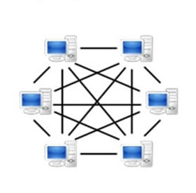
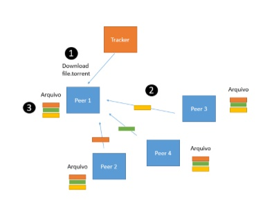
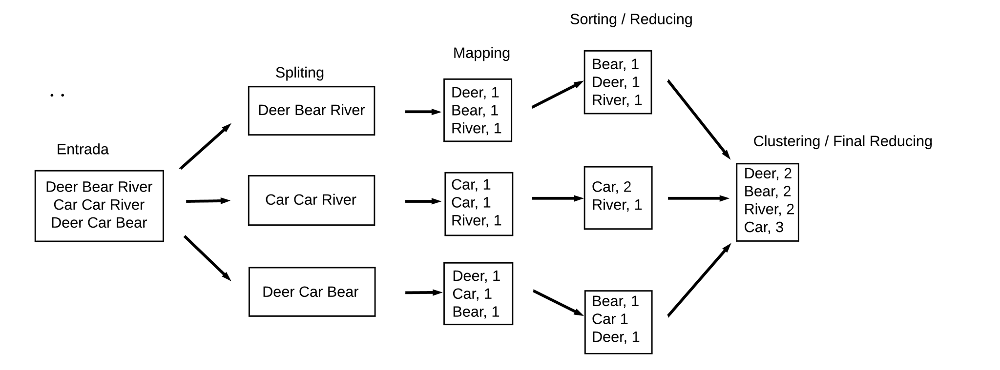
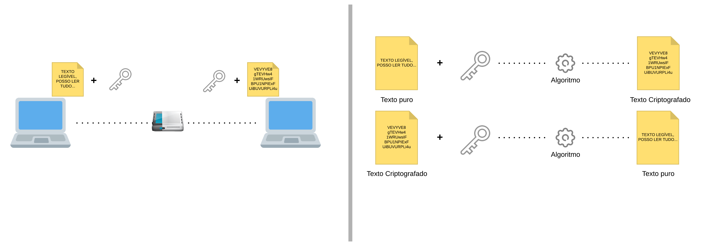
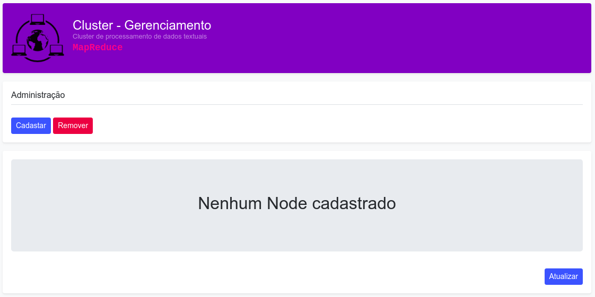
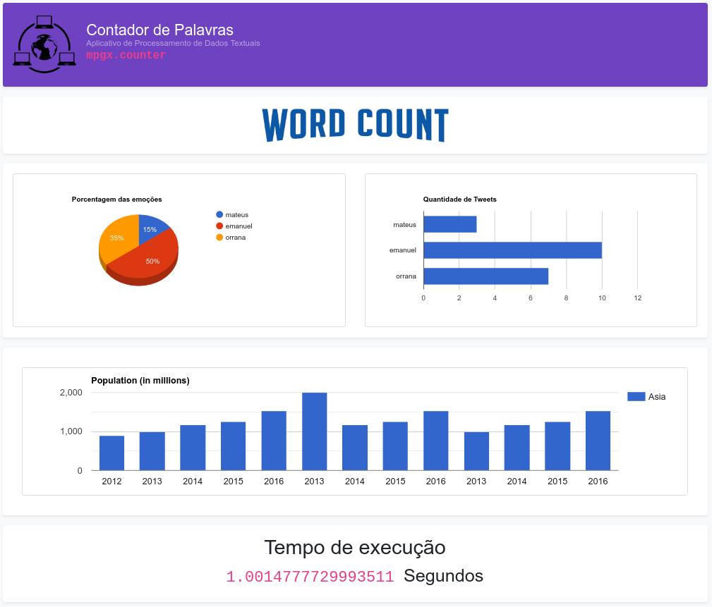

# Sistemas Distribuídos
Segundo Tanenbaum, um sistema distribuído é um conjunto de computadores independentes entre si, e até diferentes, ligados através de uma rede de dados, que se apresentam aos utilizadores como um sistema único e coerente.
## Exemplos:
- Sistemas de pesquisas (motores de busca)
- Sistemas financeiros
- Jogos Online
- Redes Sociais e plataformas idênticas


# Rede (P2P)
### O que é P2P?
P2P significa Peer to Peer e o 2 da sigla é um trocadilho com a palavra to ("para" em inglês), já em português, significa "par a par".
O nome se refere ao formato à disposição dos computadores interligados à rede, onde cada computador conectado realiza as funções de cliente e servidor ao mesmo tempo, dessa forma, tudo é descentralizado, sem um único servidor centralizado que detenha o arquivo e precisa se encarregar de enviar todos os milhares de pedidos ao mesmo tempo.


[Infowester](https://www.infowester.com/cluster.php)

# Rede (P2P) para compartilhamento de arquivos com o conceito de Torrent 
Acontece como cliente e servidor, no caso o Cliente é o nome dado ao pc que pede algo à rede, e servidor aquele que envia o pedido. Como não existe um servidor dedicado, veja que nenhum servidor de torrent armazena sequer um arquivinho, os arquivos estão na sua máquina, na minha, na do seu vizinho, enfim, em qualquer local do mundo. Aqui está a genialidade deste tipo de conexão: Não há uma única fonte para o seu download (como acontece quando você baixa algo de um site), há milhões de fontes só esperando sua conexão.

O serviço P2P cria uma rede virtual entre as máquinas conectadas no momento e vasculha o HD do usuário atrás da música, vídeo ou qualquer outro documento que a pessoa esteja baixando.
 o que torna a rede P2P tão eficiente é que você pode começar a baixar de uma fonte, e no momento em que esta fonte desligar sua máquina e interromper a conexão, o download recomeçará de onde parou, a partir dos dados cedidos por um outro usuário, se este novo usuário também desconectar, o processo se repetirá, ad eternum, até você completar o download



Mas e como funciona essa coisa de baixar um pouco de um, um pouco de outro, etc. não dá erro? Não, pois neste tipo de conexão, os arquivos a serem transferidos são divididos em pequenos pedaços e então compartilhados. Os pedaços são sempre os mesmos para a música X, ou jogo Y. Funciona assim: Você baixa um desses pedaços de arquivo e, logo após, você imediatamente passa a distribuí-lo aos outros usuários que estão fazendo o download do mesmo arquivo. Assim, evitam-se gargalos na transmissão dos dados e permite que mesmo aquela pessoa com uma conexão lenta de transferência consiga repassar o arquivo para milhares de pessoas. 
[Infowester](https://www.infowester.com/cluster.php)

## REDE (P2P) para compartilhamento de arquivos com o conceito de Torrent  de forma simplificada
O propósito deste presente trabalho é a abordagrm do conceito de redes P2P e Torrentcom a implementação do mesmo, seguindo as seguintes características, implementar um sistema do zero, onde um usuário poderá baixar um arquivo (que deverá ser um pdf, ou um pré-projeto de TCC) que esteja disponível em várias máquinas conectadas na rede. As máquinas da arquitetura devem ser máquinas físicas. (smartphone ou computador). Fara facilitar o entendimento, observe a seguinte figura:  
#### Arquitetura aplicada neste trabalho



A arquitetura possui um servidor chamado de Tracker, que simplesmente armazena um arquivo .torrent que contêm os seguintes dados:  
1. O nome de um arquivo a ser baixado (ex: tcc_maria_2018.pdf) 
2. Em quais peers este arquivo está presente, 
3. O tamanho (em número de palavras) de cada bloco do arquivo a ser baixado 
4. Um código hash MD5 referente ao conteúdo do arquivo. O pdf não possuirá nem figuras e nem tabelas, apenas texto. Os blocos podem ser as seções padrão do documento ou o grupo pode fazer algo mais elaborado, trabalhando com outra forma de quebra do arquivo.  

As etapas do processo de download são:  
1) O peer requerente deve baixar o arquivo torrent 
2) O peer requerente deve identificar o quão longe cada peer está para poder decidir qual bloco do arquivo pdf irá baixar daquele peer em questão. Blocos menores devem ser baixados de peeers mais distantes. Este teste de latência pode ser o resultado de um simples ping ou outra alternativa mais elaborada.
3) Por fim, o peer requerente já com o arquivo baixado deve verificar se o arquivo está completo, através de um código hash, localizado no arquivo torrent. 

#### Arquitetura mapreduce aplicado neste trabalho

## Segurança
		
Para gerenciar os arquivos entre cada node do cluster, será utilizado a criptpgrafia em base64¹ e um método de compactação **hash_string** para garantir segurança e menores quantidades de dados trafegando na rede via sockets, possibilitando uma comunicação mais rápida de node à node.

	¹Base64 é um método para codificação de dados para transferência na Internet (codificação MIME para 
	transferência de conteúdo). É utilizado frequentemente para transmitir dados binários por meios de
	transmissão que lidam apenas com texto, como por exemplo para enviar arquivos anexos por e-mail.
	[Wikipédia]- https://pt.wikipedia.org/wiki/Base64

Foi utilizado o conceito de criptografia ponto à ponto bastante conhecido graças aos mensageiros como o Whatsapp, onde a criptografia e descriptografia acontece em ambos os nós de uma conexão.
#### Representação do sistema de criptografia utilizado no Cluster e modelo base.


## Arquitetura geral do Sistema Cluster


## Contador de palavras
Como foi requisitado no trabalho, foi feita a implementação de algoritmo contador de palavras tendo como parametros de entrada, três palavras que serão buscadas a partir de um arquivo de texto.

Um contador de palavras pode ser útil para quem precisa escrever um texto que terá um limite de caracteres, ou quando se escreve um texto com um número de palavras ou caracteres específicos. Ele tem como alvo uma ampla gama de usuários: de estudante para profissional de SEO, jornalista ou escritor, o gerente da comunidade, o pesquisador ... Esses perfis podem precisar de uma calculadora para contar o número de parágrafos, frases, palavras ou letras em seus escritos, teses, mensagem, artigo ou texto.

Porém o enfoque desse trabalho é fazer a contagem unicamente das palavras, levando em consideração as três palavras dadas como entrada para que sejam buscadas, retornando o seu respectivo número de aparições no texto.


#### Tempos de Execução * Teste Simples.
- 1 - Node: 4.00460786199983 sec
- 2 - Node: 2.0028634170012083 sec

## Telas:
##### Tela Master - Sem cadastro.

##### Tela Master > Cadastrar Nodes/Slaves.

##### Tela Master > Remover Nodes/Slaves.

##### Tela Master - Com cadastro.

##### Tela Cliente > Efetuando Query.

##### Tela Cliente/Resultados > Retorno das ocorrências


## Acknowledgements:


```LateX
@misc{sdtorrent,
 title   ={A prototype network p2p},
 url     ={https://github.com/TiagoOlivv/prototype-network-p2p/},
 organization={AbnTeX},
 urlaccessdate={4 jun. 2019}
}
```
```LateX
Use \cite{sdtorrent}
```
